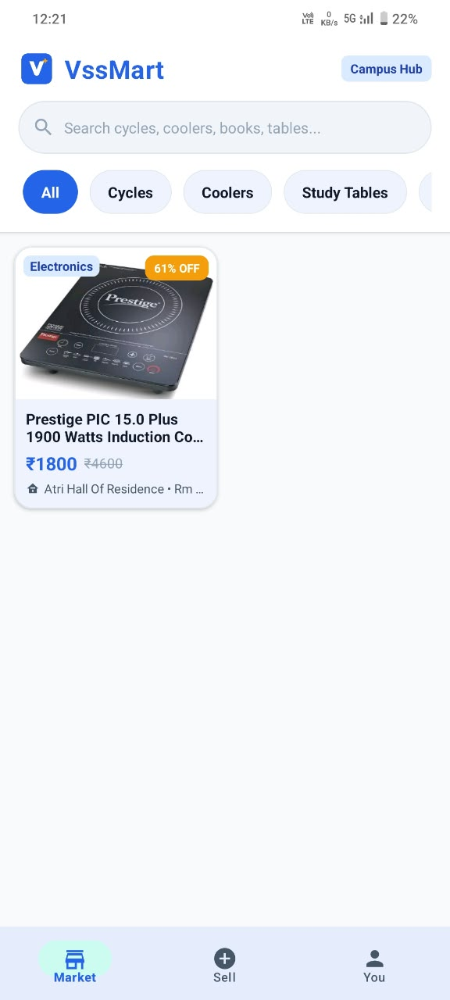
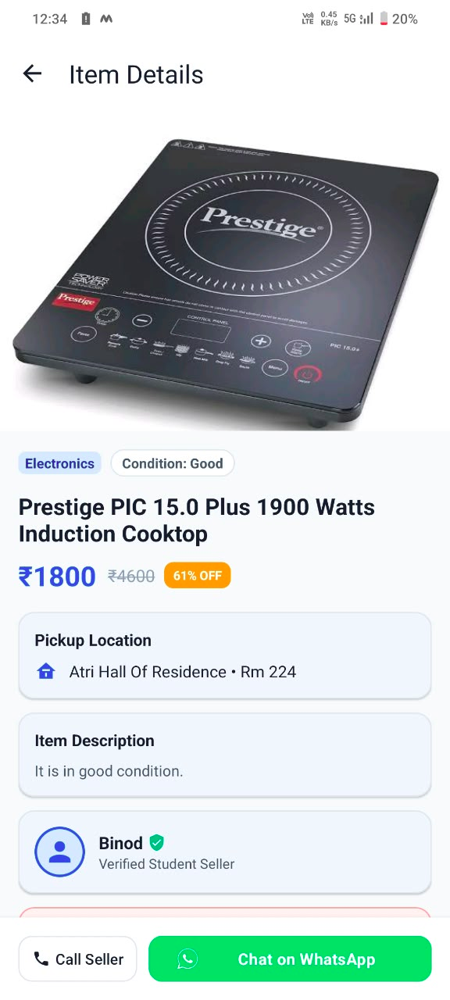
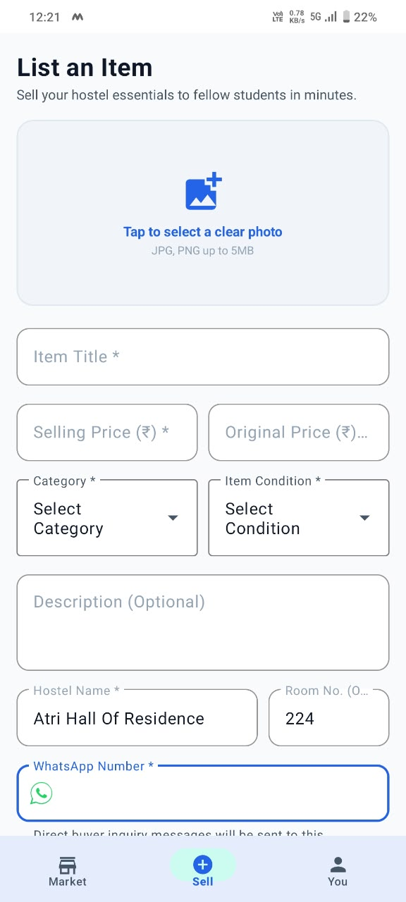
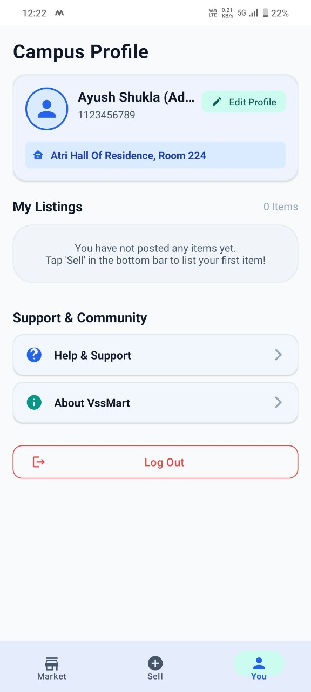

# VssMart (VMart) - Campus Marketplace Android App

Production-grade native Android marketplace application built in **Java (JDK 17+)** designed for college campus students to buy and sell pre-owned hostel essentials (cycles, coolers, study tables, books, mattresses, kettles, electronics).

---

## 🏛️ Architecture & Tech Stack

- **Language**: Native Java (JDK 17+)
- **Architecture**: Strict MVVM (Model-View-ViewModel) + Repository Pattern
- **UI Toolkit**: Material Design 3 (MD3), ConstraintLayout, CardView, BottomNavigationView, ViewBinding
- **State Management**: LiveData & MediatorLiveData observables with `Resource<T>` wrapper
- **Authentication**: Firebase Authentication (Google Sign-In & Firebase Phone OTP with `PhoneAuthProvider`)
- **Database**: Cloud Firestore (`users`, `listings`, `feedback`)
- **Storage & Caching**: Firebase Storage with Bumptech Glide 4.16 image caching and fallback handling
- **Direct Buyer-Seller Chat**: Native WhatsApp Intent API with Indian phone number sanitization (+91 normalization) and pre-filled product inquiries

---

## 📂 Project Structure

```text
io.mastercoding.vssmart/
├── data/
│   ├── model/
│   │   ├── UserModel.java              // User profile schema (UID, name, email, phone, hostel, room)
│   │   ├── ListingModel.java           // Product listing schema (ID, title, price, category, hostel, WhatsApp phone, isSold, timestamp)
│   │   └── FeedbackModel.java          // Feedback & query model
│   └── repository/
│       ├── AuthRepository.java         // Google Auth, Phone OTP, and session verification
│       ├── ListingRepository.java      // Firestore listing CRUD, real-time snapshot queries, filtering
│       └── UserRepository.java         // Firestore profile fetch, update, and local cache
├── viewmodel/
│   ├── AuthViewModel.java              // Handles login states, OTP trigger/verification, session state
│   ├── ListingViewModel.java           // Exposes LiveData for active listings, category chips, search queries, upload states
│   └── UserViewModel.java              // Exposes LiveData for user profile sync, my listings, updates
├── view/
│   ├── splash/
│   │   └── SplashActivity.java         // "VMart" -> "VssMart" logo expansion animation & session auto-route
│   ├── auth/
│   │   ├── AuthActivity.java           // Google Sign-In & Phone OTP Material bottom sheets/screens
│   │   └── OtpVerificationDialog.java  // 6-digit OTP entry dialog
│   ├── main/
│   │   ├── MainActivity.java           // Hosts BottomNavigationView & Fragment transitions
│   │   ├── MarketFragment.java         // Tab 1: Search bar, category filter chips, 2-column grid feed
│   │   ├── AddListingFragment.java     // Tab 2: Image picker, mandatory WhatsApp input, upload form
│   │   └── YouFragment.java            // Tab 3: Editable campus profile (hostel, room), My Listings, Settings
│   ├── detail/
│   │   └── ListingDetailActivity.java  // Full item specs & WhatsApp intent redirect with pre-filled text
│   ├── support/
│   │   ├── HelpFeedbackActivity.java   // FAQs & Firestore feedback submission
│   │   └── AboutActivity.java          // Developer profile (Ayush Shukla), college info, GitHub links
│   └── adapter/
│       ├── ListingAdapter.java         // Clean ViewHolder with Glide binding & click listeners
│       ├── MyListingsAdapter.java      // User's own items with "Mark as Sold" / "Delete" actions
│       └── CategoryChipAdapter.java    // Horizontal category filter chips
└── utils/
    ├── Constants.java                  // Firestore collection names, category list, Intent extras
    ├── WhatsAppHelper.java             // Sanitizes Indian phone numbers (+91) & builds URI intents
    ├── Resource.java                   // Generic UI state wrapper (SUCCESS, ERROR, LOADING, CODE_SENT)
    └── SharedPrefManager.java          // Offline session & campus profile caching
```

---

## ⚙️ Setup & Configuration Instructions

### 1. Firebase Configuration (`google-services.json`)
1. Create a Firebase project in the [Firebase Console](https://console.firebase.google.com/).
2. Add an Android app with package name `io.mastercoding.vssmart`.
3. Download `google-services.json` and place it in the `app/` directory:
   ```bash
   vssmart/app/google-services.json
   ```
4. Generate the **SHA-1 Fingerprint** of your debug keystore:
   ```bash
   keytool -list -v -keystore ~/.android/debug.keystore -alias androiddebugkey -storepass android -keypass android
   ```
5. Add the SHA-1 fingerprint to your Firebase Android app settings (required for Phone OTP and Google Sign-In).

### 2. Enable Authentication Providers
In Firebase Console > Authentication > Sign-in method:
- Enable **Google Sign-In**
- Enable **Phone Verification**

### 3. Deploy Firestore & Storage Security Rules
- Apply `firestore.rules` for collection rules.
- Apply `storage.rules` for image upload restrictions.

---

## 🚀 Key Features

1. **Brand Experience**: Splash animation with "VMart" -> "VssMart" transition and intelligent auto-routing based on cached session state.
2. **2-Column Market Grid Feed**: Real-time Firestore snapshot synchronization, live text search, dynamic category chip filtering (Cycles, Coolers, Study Tables, Books, Mattresses, Kettles, Electronics), and pull-to-refresh.
3. **Seamless Photo Picker**: Leverages Android 13+ `ActivityResultContracts.PickVisualMedia()` for privacy-friendly photo picking without broad storage permissions.
4. **Direct WhatsApp Integration**: Sanitizes and normalizes phone numbers (+91), verifies WhatsApp / WhatsApp Business installation, and pre-populates product inquiries.
5. **Campus Identity & Listings Management**: Personalized profile with Hostel & Room details, "Mark as Sold" toggles, and deletion confirmation dialogs.

## 📱 Application Preview

| Feed Screen | Product Details | Add Listing | Profile Screen |
| :---: | :---: | :---: | :---: |
|  |  |  |  |